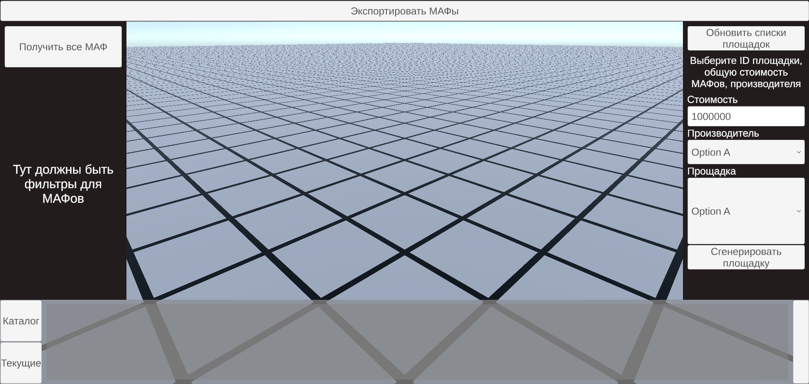

# MAF_Builder_Build

## Запуск

На данный момент приложение работоспособно только в локальной сети на одном компьютере.

Первое, что следует сделать - установить бэк:
https://github.com/nameunique/MAF_Builder_Back
и переключиться на ветку sof_dev
``` bash
git clone https://github.com/nameunique/MAF_Builder_Back.git
cd MAF_Builder_Back
git checkout sof_dev

для запуска
python .\main.py
```
requirements.txt или env для бэка будут позже

Второе - установить фронт:
https://github.com/nameunique/MAF_Builder_Build

``` bash
git clone https://github.com/nameunique/MAF_Builder_Build.git
cd MAF_Builder_Build
npm install

для запуска
node .\main.js

в терминале должно появиться
Server has started! At http://localhost:8080
```

Готово.

## Работа с приложением



Для корректной работы сначала нужно нажать на кнопку "Получить все МАФ" и кнопку "Обновить списки площадок".

После нажатия на первую будет производиться постепенное скачивание всех изображений МАФов, что потребует в общей сумме ~4 гигабайт оперативной памяти. Исправление данного нюанса в планах.

На нижней панеле появятся изображения МАФов, которые можно посредством drug&drop перетаскивать на 3D плоскость. Элементы на 3D плоскости так же можно перемещать при помощи drug&drop, а удаление производится при помощи перемещения трехмерного объекта на зону интерфейса.

Система заявляется как полуавтоматическая, поэтому большинство действий будет производиться оператором. К примеру, для автоматической генерации МАФов для площадки, оператору следует сначала заполнить соотвествующие поля, а после "Сгенерировать площадку".

## Полезные ссылки и замечания

Бэк запускался при помощи Python311
https://www.python.org/downloads/release/python-3110/

Фронт запускается при помощи nodejs
https://nodejs.org/en/download/prebuilt-installer

После установки не забудьте поправить/добавить пути в глобальных переменных системы до исполняемых файлов python и nodejs для последующей удобной работы ;) 